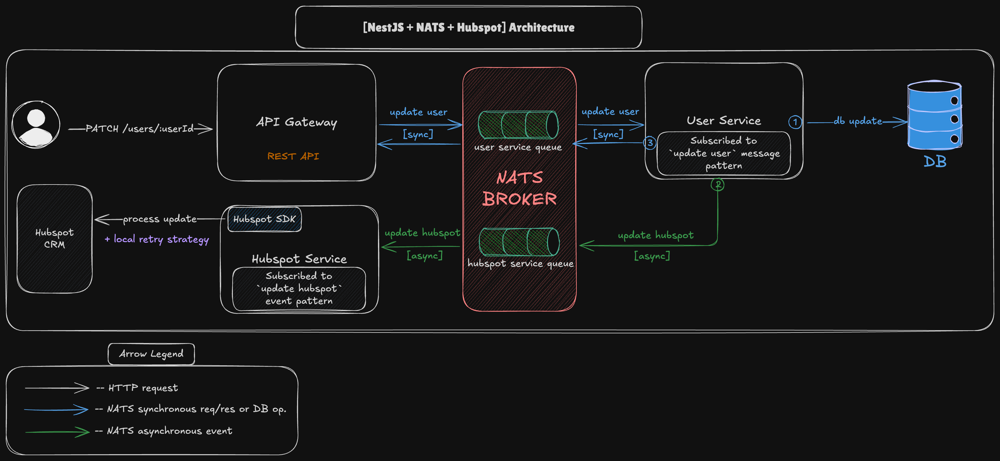

# Tech task showcasing NestJS, NATS and Microservices

## Architecture



> source .excalidraw file located in `docs/architecture.excalidraw`

## Local setup (everything in docker-compose)

1. Set environment variables on necessary levels:

```sh
# Assuming you are in the root directory
cp nats.env.example nats.env && \
cp services/api-gateway/.env.example services/api-gateway/.env && \
cp services/hubspot/.env.example services/hubspot/.env
```
> [!NOTE]
> `nats.env` **can be left _unchanged_**, using example values.

> [!WARNING]
> `services/api-gateway/.env` **should be left _unchanged_** for local docker-compose setup, using example values, as this will use proper port - `3030`.

> [!NOTE]
> `user service` does not have any env files

> [!WARNING]
> `services/hubspot/.env` **should be _changed_** to use proper values (your Hubspot OAUTH token).

1. Build the whole thing with docker compose:

```sh
docker compose up --build -d
```

3. API Gateway will be available at port `3030` - http://localhost:3030
---

## Usage
API Gateway exposes single endpoint:

- `PATCH` http://localhost:3030/users/:userId
- Request body:
```json
{
  "email": "john.doe@hubspot.com",
  "firstName": "John",
  "lastName": "Doe"
}
```
- `firstName` & `lastName` are both optional
- `email` is required _(in real case scenario, this would be optional as well, but we need it to update the user in Hubspot by email)_
- contact with specified `email` must exist in Hubspot CRM to update it on Hubspot level as well _(though request will still go through with missing contact, executing mocked DB update only)_

### Example curl request with existing contact in Hubspot

```sh
curl -X PATCH http://localhost:3030/users/1 \
  -H "Content-Type: application/json" \
  -d '{"email": "bh@hubspot.com", "firstName": "Max", "lastName": "R."}'
```
---

## Implementation notes & considerations
- `hubspot service` has local retry strategy in place, to handle transient errors from Hubspot API with progressive backoff.
- `hubspot service` is using [Hubspot SDK](https://www.npmjs.com/package/@hubspot/api-client) to interact with Hubspot API.
- `api-gateway` has primitive validation in place, to ensure that request body is valid.
- `user service` executes emulated DB update, without any persistence and no in-memory storage.
- communication between `api-ateway` and `user service` is _synchronous_ (request-response through NATS).
- communication between `user service` and `hubspot service` is _asynchronous_ (event-driven via NATS), meaning that `user service` does not wait for `hubspot service` to finish processing the request.
- there is a `shared` module, as a separate pnpm-workspace package, containing types and enums used across multiple services.
- there is a single `Dockerfile` for the whole project with multiple stages, each stage except build represents a single service.
- docker compose file is located in the root directory, to allow running all services in one go, it is leveraging multi-stage build feature and service definitions to build different containers for each service from a single `Dockerfile`.

#### Considerations for further improvements
- Share more code (e.g. DTOs) between services
- Optimize `Dockerfile`
- Use real DB
- Switch to update hubspot contact by `contactId` instead of `email`
- Setup monorepo toolchain (`turborepo`, etc.)
- Avoid 400 & 404 error retries in `hubspot service` (depending on possible data inconsistency cases)
- Implement a NATS persistence layer (`--jetstream`) for broker retries
---

## Alternative local setup (dockerized NATS + local services)

Alternatively, you can run a lightweight setup with just NATS:

```sh
docker compose -f docker-compose-lightweight.yml up --build -d
```

0. Setup env files (see `Local setup (everything in docker-compose)` in the beginning of the README)
1. Install packages:

```sh
# Assuming you are in the root directory
pnpm install
```

2. Run the necessary services the way you see fit:

```sh
cd services/api-gateway
pnpm start:dev
# or
pnpm start
# etc.
```
---